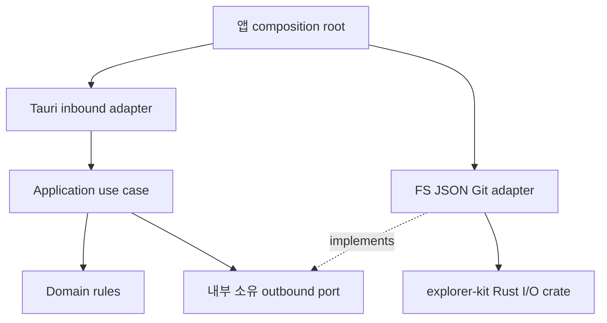
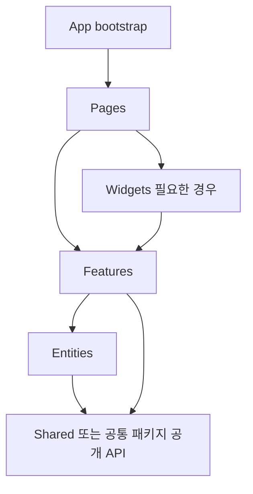

# 다섯 앱의 Hexagonal·FSD 아키텍처 리뷰

> 후속 상태: H1~H5/F1~F3 수정 구현과 앱 검증을 마쳤습니다. 독립 리뷰·검증 결과는 [아키텍처 수정 보고서](architecture-fix-report.md)에서 관리합니다. 아래 본문과 import 증거는 수정 전 상태를 보존한 기록이며 현재 코드의 줄 번호와 다를 수 있습니다.

2026-10-04 현재 로컬 작업 트리 기준입니다. 기존 공통 코드 적용을 포함한 전체 구조를 리뷰했으며 새 변경만의 PR 리뷰가 아닙니다. 소스 수정은 하지 않았습니다. P2는 일반 우선순위의 구조 수정, P3는 낮은 우선순위의 경계 개선입니다. 런타임 결함의 심각도와 구분합니다.

## 주요 지적

### H1 · P2 · Repo: 유스케이스가 Tauri와 실제 I/O에 묶여 있음

[run_scan:258](../../repo-explorer/apps/desktop/src-tauri/src/lib.rs#L258) · [metadata update:319](../../repo-explorer/apps/desktop/src-tauri/src/lib.rs#L319) · [git adapter:593](../../repo-explorer/apps/desktop/src-tauri/src/lib.rs#L593)

`run_scan`이 AppHandle을 받아 이벤트를 내보내고 실제 경로 정규화·탐색·Git 검사를 직접 실행합니다. metadata 갱신도 AppHandle과 JSON catalog 저장, Git/파일 재조회에 직접 의존합니다. 같은 lib.rs에 DTO·정책·명령·파일 접근·Git process·설정 경로가 있지만 핵심 문제는 파일 크기가 아니라 외부 구현을 교체할 포트가 없다는 점입니다. 이 상태에서 핵심 유스케이스를 메모리 repository와 가짜 Git 응답으로 독립 실행할 수 없습니다.

권장: `ScanRepositories`/`UpdateMetadata` application 서비스, `RepositoryInspector`, `CatalogRepository`, `MetadataRepository`, progress sink 포트를 내부에 둡니다. Git/FS/JSON 구현은 outbound adapter, Tauri command·emit·spawn_blocking은 inbound adapter, 조립은 lib.rs에 둡니다. 공통 fs/json/scan-job crate는 adapter가 사용합니다. Repo AGENTS.md의 hexagonal 명시 규칙에도 어긋납니다.

### H2 · P2 · Bookmark: application → infrastructure 직접 의존

[Bookmarks import:2](../../site-bookmark-browser/src-tauri/src/application/bookmarks.rs#L2) · [Groups import:4](../../site-bookmark-browser/src-tauri/src/application/groups.rs#L4)

Bookmarks가 구체 JsonBookmarkStore와 LibraryImages를 필드로 갖고, Groups가 JsonSettingsStore를 요구합니다. domain/application/infrastructure 디렉터리는 있지만 의존성 역전은 성립하지 않습니다. 파일 기반 fixture로 테스트할 수는 있으나 다른 저장 방식이나 실패 모형을 포트 교체만으로 주입할 수 없습니다.

권장: 내부의 BookmarkRepository·GroupRepository·ImageRepository 계약에 의존하게 합니다. 특히 기존 `update` 잠금 범위를 `load`→`save` 두 호출로 쪼개면 경쟁 조건이 재발합니다. transactional update 또는 유스케이스 단위 원자적 repository 연산을 포트 계약으로 유지해야 합니다. domain의 serde derive만으로 이 위반을 판단한 것은 아닙니다.

### H3 · P2 · Folder: domain 포트는 있지만 주요 정책이 adapter에 남아 있음

[JSON group delete:220](../../movie-folder-explorer/src-tauri/src/infrastructure/json_last_opened_directory_store.rs#L220) · [thumbnail command:47](../../movie-folder-explorer/src-tauri/src/interface/commands.rs#L47) · [stream command:127](../../movie-folder-explorer/src-tauri/src/interface/commands.rs#L127)

Folder는 DirectoryScanner/DirectoryRenamer/설정 store trait와 generic application 서비스를 갖추어 가장 좋은 출발점입니다. 그러나 마지막 그룹 삭제 금지·삭제 뒤 활성 그룹 선택·없는 그룹 활성화 거부는 JSON adapter에서 결정합니다. adapter를 교체하면 같은 정책을 다시 구현해야 합니다. 썸네일 command는 videoId/COVER 검증부터 저장 결과 처리까지 수행하고, streaming scan은 기존 ScanDirectories/DirectoryScanner 포트를 우회해 concrete scanner를 직접 호출합니다.

권장: 그룹의 규칙은 domain의 순수 연산으로, scan/save-thumbnail/rename-and-refresh 조합은 application 유스케이스로 이동합니다. streaming/cancellation을 표현하는 scanner 포트를 보강하고 Tauri event DTO 변환은 command 쪽에 남깁니다. JSON schema migration과 실제 파일 쓰기는 adapter 책임을 유지합니다. 명령에서 concrete adapter를 생성하는 조립 행위 자체는 위반이 아닙니다.

### H4 · P2 · Bookmark: 그룹 삭제 유스케이스가 inbound adapter에 있음

[delete_group_from_stores:20](../../site-bookmark-browser/src-tauri/src/interface/commands.rs#L20)

`delete_group_from_stores`가 그룹 mutation mutex, 마지막 그룹 검증, 북마크·이미지 삭제, settings 삭제의 순서를 command 모듈에서 조합합니다. 다른 inbound adapter에서 동일한 그룹 삭제를 호출하면 이 규칙을 따로 알아야 합니다. Groups::delete_group만으로는 사용자 동작 전체를 수행하지 못합니다.

권장: `DeleteGroup` application 서비스와 일관성/작업 단위 계약으로 옮기고 command는 입력 변환과 호출만 담당합니다. 실제 잠금 구현은 adapter에 둘 수 있지만 어떤 작업을 함께 직렬화하는지는 유스케이스 계약에 명시합니다. 이 이동만으로 여러 파일에 대한 원자적 transaction이 생기지는 않으며 기존 이미지 선삭제 결함은 별도 수정 대상입니다.

### F1 · P2 · Tree: 서로 다른 feature slice가 상호 의존

[settings → toggle:4](../../tauri-tree-file-explorer/apps/desktop/src/features/settings/ui/ExplorerSettingsControls.tsx#L4) · [toggle → settings:4](../../tauri-tree-file-explorer/apps/desktop/src/features/toggle-hidden-files/ui/ToggleHiddenFilesButton.tsx#L4)

settings UI가 toggle-hidden-files를 가져오고 toggle-hidden-files가 settings store를 가져옵니다. 같은 feature 레이어의 다른 slice 간 의존이며 공개 index를 거쳐도 허용되지 않습니다. 이는 slice 그래프의 양방향 결합입니다. 현재 settings/index.ts는 model만 export하므로 실제 JS 모듈 순환이나 런타임 오류가 발생한다고 단정하지는 않습니다.

권장: 같은 사용자 설정 기능이므로 toggle UI를 settings slice 안으로 합치는 것이 가장 작습니다. 별도 feature가 꼭 필요하면 공통 preferences 모델을 낮은 레이어에 두고 page/widget에서 두 UI를 조합합니다. index에 UI export만 추가하는 것으로는 양방향 slice 의존이 해결되지 않습니다.

### F2 · P2 · 다섯 앱: slice 공개 API 우회 25건

[Movie preferences:33](../../movie-explorer/apps/desktop/src/pages/home/index.tsx#L33) · [Folder entry:1](../../movie-folder-explorer/src/App.tsx#L1) · [Bookmark entity:2](../../site-bookmark-browser/src/features/bookmark-browser/model/use-bookmarks.ts#L2) · [Tree settings UI:6](../../tauri-tree-file-explorer/apps/desktop/src/widgets/file-list-panel/ui/FileListPanel.tsx#L6)

외부 slice가 `entities/.../model/types`, `features/.../ui/...`를 직접 가져옵니다. Movie1, Folder7, Repo1, Bookmark15, Tree1건이며 slice 내부 파일 경로가 소비자 계약이 되어 내부 이동의 영향 범위가 커집니다. Folder/Bookmark entity와 feature, Movie preferences, Repo preferences에는 필요한 root 공개 API를 마련해야 합니다.

권장: 필요한 타입·동작·UI만 slice index에서 명시적으로 export하고 외부 import를 index 경계로 제한합니다. wildcard export를 일괄 추가하지 않습니다. 동일 slice 안에서는 상대 경로로 내부 모듈을 사용합니다. `@yoophi/ui-base/components/button` 같은 workspace 패키지의 명시된 subpath export는 FSD slice 우회로 집계하지 않았습니다.

### F3 · P3 · Repo: Shared가 App provider를 가져옴

[StorybookProviders:1](../../repo-explorer/apps/desktop/src/shared/storybook/storybook-providers.tsx#L1)

shared/storybook이 app/providers/query를 import합니다. 테스트·Storybook용이라도 Shared→App의 역방향 의존입니다. 현재 프로덕션 사용 경로의 결함으로 판단하지는 않지만, Shared를 앱 독립 계층으로 재사용할 수 없게 합니다.

권장: 이 조립용 provider를 `.storybook` 또는 app의 테스트 조립 영역으로 옮깁니다. 재사용할 낮은 계층 provider가 실제 필요할 때만 Shared에 독립 구현을 두고 App이 그 구현을 사용합니다.

### H5 · P3 · Movie·Tree: 얇은 command/I/O 연결은 있으나 포트 기반 코어는 미구성

[Movie scan:29](../../movie-explorer/apps/desktop/src-tauri/src/lib.rs#L29) · [Tree list:14](../../tauri-tree-file-explorer/apps/desktop/src-tauri/src/lib.rs#L14)

Movie는 기본 glob 정책과 공통 scan_files 호출, Tree는 home 경로와 list_dir 호출을 command 모듈에 둡니다. blocking offload와 공통 Rust 코드의 Tauri 분리는 잘 되어 있지만 scanner/listing을 대체할 앱 내부 포트는 없습니다. 따라서 완전한 hexagonal 준수로 판정하지는 않습니다. 다만 도메인이 작은 파일 탐색 앱이므로 Repo와 같은 정도의 구조 부채로 취급할 이유도 없습니다.

권장: 신규 규칙이 추가되거나 fake filesystem 테스트가 필요할 때 작은 application 함수와 scanner/listing 포트를 도입합니다. 폴더 세 개를 만드는 것만으로 해결되지 않으며 모든 command에 빈 service wrapper를 추가하는 것도 권하지 않습니다.

## 앱별 종합 판정

| 앱 | 백엔드 | 프론트엔드 | 우선 조치 |
| --- | --- | --- | --- |
| Movie | 얇은 adapter 구조, 포트 기반 코어 미구성(H5) | 대체로 레이어 방향 준수, preferences 공개 API 누락(F2) | 공개 API 보완. backend는 정책 확장 시 작은 port 도입 |
| Folder | 부분 준수. trait 기반 service 존재, adapter에 정책·유스케이스 잔존(H3) | entity/feature 구분은 있으나 공개 API 누락과 화면 전체가 feature에 집중 | 그룹 규칙/stream port, entity/feature index, page 단위 책임 정리 |
| Repo | 개선 우선. Tauri·I/O·Git·유스케이스 혼합(H1), 자체 AGENTS 위반 | 주 방향은 적절하나 F2/F3 존재, page에 조립 외 책임 집중 | backend 서비스/port 분리, shared 역방향 제거 |
| Bookmark | 디렉터리 분리는 있으나 application→concrete infra(H2), command의 삭제 조합(H4) | entity와 feature 존재, 공개 API 우회가 가장 많음 | transaction을 보존하는 repository port와 DeleteGroup 서비스 |
| Tree | 작은 adapter 구조, 포트 기반 코어 미구성(H5) | 가장 세분된 FSD 구조이나 feature 교차 의존(F1)·공개 API 우회(F2) | settings/toggle slice 정리 |

“대체로 준수”는 인증이나 정량 점수가 아닙니다. 폴더 존재 여부보다 현재 실행 경로의 책임과 의존성을 기준으로 판정했습니다.

## 명확한 위반과 분리한 개선 권고

- **Folder/Bookmark 전체 화면을 feature에 배치:** App.tsx가 folder-browser/bookmark-browser feature의 전체 화면을 바로 표시합니다. 한 feature가 그룹·이미지·필터·편집·스캔/가져오기를 모두 소유합니다. 화면 자체는 pages에 두고 실제 재사용되는 사용자 행동만 feature로 추출하는 편이 의미에 맞습니다. 단일 페이지라는 이유로 widgets를 반드시 만들 필요는 없습니다. 이 항목은 위의 import 규칙 위반과 구분한 책임 배치 개선입니다.
- **Movie/Repo 페이지의 큰 구현:** 트리 생성·필터·scan lifecycle·metadata draft가 page UI와 함께 있습니다. 최신 FSD는 페이지 전용 로직을 pages 안에 두는 것을 허용하므로 파일 길이만으로 FSD 위반이라 하지 않습니다. 다만 두 앱 AGENTS는 page의 화면 조립, framework/외부 API로부터 도메인 분리, query hook 사용을 더 엄격히 요구합니다. `pages/.../model`·`lib`로 순수 모델을 먼저 분리하고 재사용할 때 feature/entity로 이동하면 됩니다.
- **상태관리 도구:** FSD는 Zustand나 React Query를 강제하지 않습니다. Movie/Repo AGENTS에는 Zustand 지침이 남아 있으나 이후 사용자 요청에 따른 settings-core 채택을 다시 Zustand로 되돌릴 근거는 아닙니다. 현재 합의된 저장 방식과 문서의 정책 차이는 별도로 정리할 사항입니다. 컴포넌트 내부 임시 상태를 local state로 두는 것은 문제없습니다.
- **serde/Path 사용:** domain 타입에 serde derive나 std::path 타입이 있다는 사실만으로 hexagonal 위반이라 단정하지 않았습니다. 파일 접근·Tauri/Git의 구체 구현 의존 및 유스케이스 테스트 가능성을 보았습니다.
- **공통 저장소:** 공통 crate를 호출한다고 앱 내부의 의존성 역전이 자동으로 완성되지는 않습니다. 반대로 공통 패키지의 공개 subpath API는 앱 slice의 내부 파일 접근과 다릅니다. 검토한 settings/core UI·file-tree/list·rating 소스에는 소비 앱 alias/Tauri/Router/React Query import를 발견하지 못했습니다.

## 권장 의존 구조

우선 Tree feature 교차 의존과 공개 API·Repo shared 역방향을 작은 변경으로 해결하고, Bookmark repository port와 DeleteGroup 서비스, Folder 그룹 정책/streaming port, Repo backend 분리를 진행하는 순서가 적절합니다. 이후 공통 기능 승격은 앱 port 뒤 adapter 또는 낮은 프론트엔드 레이어에서 소비하도록 연결합니다.

검증 기준은 (1) domain/application에 concrete infrastructure·Tauri·Git process import가 없는지, (2) 메모리 fake로 유스케이스 성공/실패/취소를 테스트할 수 있는지, (3) FSD layer·slice·public API 검사 통과, (4) 기존 동작·schema·transaction 잠금 보존입니다. app command의 타입·이벤트·serializer 계약도 유지해야 합니다. 도구 설치나 구조 수정은 이번 리뷰에서 수행하지 않았습니다.

## 조사 방법과 근거

Rust domain/application/infrastructure/interface와 command 실행 경로를 직접 읽었습니다. 프론트엔드는 5개 앱 src의 정적 import/export-from 및 상대 경로·@/ alias를 경량 스크립트로 조사한 뒤 결과를 수동 확인했습니다. 전체 AST resolver나 공식 architecture linter를 실행한 결과는 아니며 dynamic import·다른 alias·package 내부까지의 완전한 그래프 증명은 아닙니다. 전체 테스트/네이티브 앱은 재실행하지 않았습니다.

[FSD import 증거 목록](architecture-import-audit.json)에 28개 경계 참조(공개 API 우회25·feature 교차2·역방향1)를 남겼습니다. 실제 위치 기준이므로 후속 수정 시 줄 번호는 달라질 수 있습니다. 이전 기능 결함 리뷰와 공통 후보 조사에서 발견한 문제는 본 구조 리뷰로 해결된 것이 아닙니다.

판정 기준은 [FSD Layers](https://feature-sliced.design/docs/reference/layers), [FSD Public API](https://feature-sliced.design/docs/reference/public-api), [Cockburn의 Hexagonal Architecture 원문](https://alistair.cockburn.us/hexagonal-architecture)을 확인했습니다. 핵심은 하위 레이어 의존·slice 공개 계약과 외부 장치에서 독립 실행 가능한 application입니다. 앱별 AGENTS의 추가 지침은 위반 여부와 별도로 명시했습니다.
