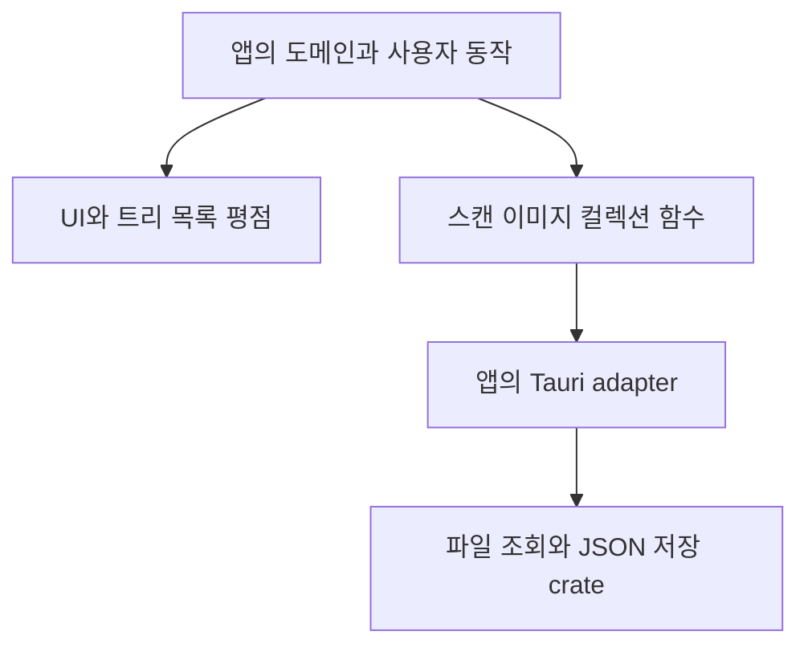

# 공유 경계와 통합

UI와 Rust I/O는 별도 패키지로 제공하고 앱이 연결합니다. Base UI와 Radix UI API는 섞지 않습니다. 스캔 클라이언트와 이미지 입력에는 Tauri 의존성이 없습니다.

공통 저장소 검증 후 소비 앱별로 관련 패키지를 적용합니다. 원본의 미커밋 작업을 보존하고, 기능 변경을 공통 코드 적용과 함께 섞지 않습니다.

| 앱 | 우선 적용 | 유지할 계약 |
| --- | --- | --- |
| movie-explorer | core formatter, fs-core scan, dev-tools | 영상 기본 glob, snake_case DTO, 세 가지 목록 보기, 기존 테마 |
| movie-folder-explorer | ui-base, scan-client, image-input, collection-core, json-store | folder 이벤트 adapter, 폴더명 메타데이터, rename 부작용, cache schema |
| repo-explorer | json-store, dev-tools | repository별 메타데이터 위치, 카탈로그 schema, worktree 관계 |
| site-bookmark-browser | ui-base, rating, image-input, collection-core, json-store | URL identity, 0.5점 평점, v1/v2 migration과 이미지 경로 |
| tauri-tree-file-explorer | ui-radix, core, file-tree, file-list, fs-core list | URL 선택 동기화, 지연 로딩, 숨김 토글, 패널 저장 |

통합 결과는 각 앱의 typecheck/build, 기존 도메인 테스트, Rust 테스트로 확인합니다. 추가 리뷰에서는 원본 데이터 호환성, React 중복 인스턴스, CSS 탐색 범위, 이벤트 종료·cleanup을 우선 확인합니다.
