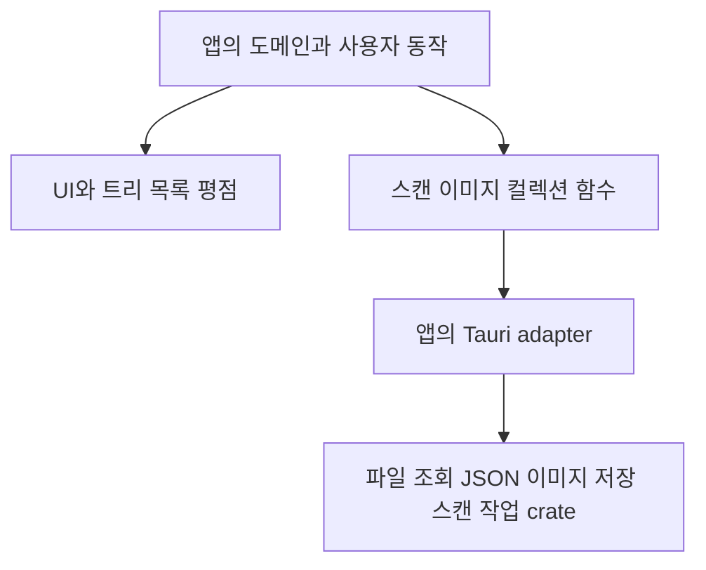
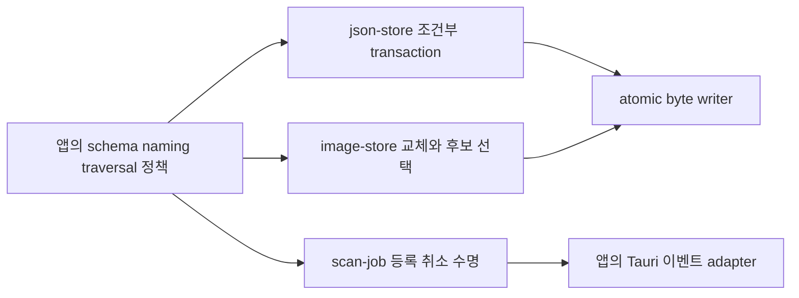
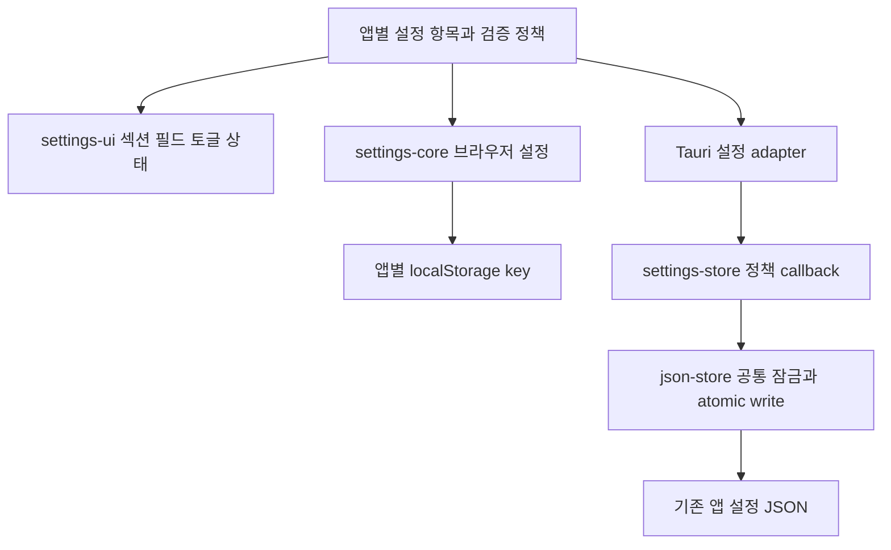

# 공유 경계와 통합

UI와 Rust I/O는 별도 패키지로 제공하고 앱이 연결합니다. Base UI와 Radix UI API는 섞지 않습니다. 스캔 클라이언트와 이미지 입력에는 Tauri 의존성이 없습니다.

공통 저장소 검증 후 소비 앱별로 관련 패키지를 적용합니다. 원본의 미커밋 작업을 보존하고, 기능 변경을 공통 코드 적용과 함께 섞지 않습니다.

| 앱 | 우선 적용 | 유지할 계약 |
| --- | --- | --- |
| movie-explorer | core formatter, fs-core scan, dev-tools | 영상 기본 glob, snake_case DTO, 세 가지 목록 보기, 기존 테마 |
| movie-folder-explorer | ui-base, scan-client, image-input, collection-core, json-store | folder 이벤트 adapter, 폴더명 메타데이터, rename 부작용, cache schema |
| repo-explorer | json-store, dev-tools | repository별 메타데이터 위치, 카탈로그 schema, worktree 관계 |
| site-bookmark-browser | ui-base, rating, image-input, collection-core, json-store | URL identity, 0.5점 평점, v1/v2 migration과 이미지 경로 |
| tauri-tree-file-explorer | ui-radix, core, file-tree, file-list, fs-core list | URL 선택 동기화, 지연 로딩, 숨김 토글, 패널 저장 |

통합 결과는 각 앱의 typecheck/build, 기존 도메인 테스트, Rust 테스트로 확인합니다. 추가 리뷰에서는 원본 데이터 호환성, React 중복 인스턴스, CSS 탐색 범위, 이벤트 종료·cleanup을 우선 확인합니다.

## 백엔드 공통 기능 승격

공통 JSON transaction은 Unchanged와 Write를 구분하며, schema를 모르는 저수준 버전 검사만 제공합니다. 이미지 저장은 filename stem을 입력받고 저장 위치와 key 생성은 앱이 정합니다. 정리 실패는 저장 경로와 함께 보고하고 묵시적 성공으로 취급하지 않습니다. 스캔 registry는 작업 ID 중복·취소 token·RAII 정리·terminal 판정을 담당하며 탐색 순서·Git 검사·영상 확장자는 알지 못합니다.

Movie와 Tree의 단일 응답 계약은 유지하며 blocking I/O는 앱 adapter에서 offload합니다. Folder의 stream DTO는 유지하고 Repo는 scanId와 취소를 앱 호출부까지 연결합니다. 모든 파일에 걸친 transaction이나 프로세스 간 lock으로 확대 해석하지 않습니다.

## 설정 UI와 저장

Movie/Repo의 화면 설정과 Tree의 숨김/패널 배치는 브라우저 설정입니다. Folder/Bookmark의 그룹·경로·별칭은 기존 Rust JSON 설정에 남깁니다. 두 저장 계층은 서로 다른 설정을 담당하며 같은 값을 중복 저장하지 않습니다. UI는 어떤 저장 방식을 사용하는지 알지 못합니다.
