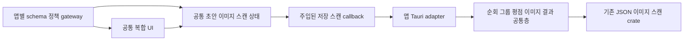

# 두 앱 이상에서 재사용 가능한 공통 기능 조사

후속 상태(2026-10-05): 사용자가 14개 후보 전체 구현을 승인했고 공통 구현·소비 앱 연결과 최종 리뷰를 진행했습니다. 현재 상태는 [구현 보고서](promotion-14-report.md)를 기준으로 확인하세요. 아래는 조사 당시 판단이며 선행 이미지·root 이슈는 [후속 수정](remaining-review-fixes-report.md)에서 이미 해결했습니다.

조사일: 2026-10-04. 현재 로컬 작업 트리의 explorer-kit과 다섯 소비 앱을 비교했습니다. M=movie-explorer, F=movie-folder-explorer, R=repo-explorer, B=site-bookmark-browser, T=tauri-tree-file-explorer입니다. 사용자가 부른 site-bookmark-explorer의 실제 저장소 이름은 site-bookmark-browser입니다.

## 결론과 선정 기준

백엔드 4개, UI 6개, 상태관리 4개 **총 14개 후보**를 확인했습니다. 같은 기능의 UI·상태·백엔드는 서로 연결되어 있으므로 14개 독립 패키지를 만들자는 의미는 아닙니다. 전부 다섯 앱에 적용할 필요는 없습니다. 특히 F/B가 가장 많은 기능을 공유하고 M/R에는 완전히 같은 버튼 구현과 설정 초안 동기화가 남아 있습니다.

- A: 먼저 추출하기 적절함. 두 소비처가 명확하고 작은 경계로 기존 동작을 보존할 수 있음.
- B: 조건부 승격. 두 소비처는 있지만 서로 다른 정책을 API와 계약 테스트로 먼저 구분해야 함.
- C: 보류. 두 앱의 구조는 비슷하나 지금 추상화하면 정책 인자가 과도해지거나 이득이 작음.

A/B/C는 결함 심각도가 아니라 구현 순서입니다. 코드 위치는 아래 링크와 함수명으로 추적합니다. 완전 동일성은 버튼에 대해서만 직접 확인했고 나머지는 구현을 읽고 추출 가능한 공통 책임을 판단한 결과입니다. 조사만 수행했으며 공통 코드나 소비 앱을 변경하지 않았습니다.

## 이미 공통화된 범위

| 현재 공통 모듈 | 이번 조사에서 남은 부분 |
| --- | --- |
| ui-base / ui-radix, rating, file-list / file-tree | 기본 요소 외의 복합 UI, Movie/Repo에 남은 로컬 버튼 |
| settings-core / settings-ui / settings-store | 저장값과 편집 초안 동기화, 그룹 관리 도메인 처리 |
| image-input / image-store | React 이미지 붙여넣기 수명, preview UI, 부분 성공 결과 해석 |
| scan-client / scan-job | Repo ScanSession과 Folder의 React 작업 수명, 순회 알고리즘 |
| collection-core | countTags/tagCloudSizeClass/shuffledRank 외의 필터 UI·평점 정책 |
| json-store / fs-core / core | JSON 파일 저장 자체·파일 조회·형식 표시를 새 후보로 중복 계산하지 않음 |

패키지가 이미 있다는 것과 모든 관련 소비 코드가 공통 구현을 사용한다는 것은 구분합니다. 예를 들어 rating은 현재 Bookmark에 연결되어 있고 Folder는 null과 클릭 해제 정책 때문에 별도 평점 UI를 유지합니다.

## 백엔드 후보

| ID·순서 | 기능·현재 소비처 | 권장 승격 경계 | 보존해야 할 차이 | 근거 |
| --- | --- | --- | --- | --- |
| BE1 · B | 취소 가능한 디렉터리 순회 · F/R, 후속 M | fs-core에 `walk_directories` 추가. 경로·깊이·방문 callback과 취소 검사, 재귀 진행만 담당 | F는 정렬된 DFS·root 포함·무제한·entry 오류 무시·read_dir 오류 실패, R은 BFS·maxDepth·skip 목록·PermissionDenied 건너뜀·entry 오류 실패. M은 파일/glob·symlink 제외. Git 검사·메타데이터·DTO는 앱에 유지 | [walk-f:35](../../movie-folder-explorer/src-tauri/src/infrastructure/filesystem_directory_scanner.rs#L35) · [walk-r:466](../../repo-explorer/apps/desktop/src-tauri/src/lib.rs#L466) · [walk-m:30](../../explorer-kit/crates/fs-core/src/scan.rs#L30) |
| BE2 · B | 그룹 upsert/삭제/활성 fallback · F/B | 메모리 컬렉션의 `key_of`, 존재 검사, 최소 한 그룹, 삭제 후 활성 키 선택을 순수 함수로 제공. settings-store transaction 내부에서 호출 | F는 name이 식별자, directories/contentMode 보유. B는 id/name/baseUrl 분리, 북마크·이미지 삭제 연쇄가 있음. 기본 그룹 생성과 migration도 앱 책임 | [group-rs-f:220](../../movie-folder-explorer/src-tauri/src/infrastructure/json_last_opened_directory_store.rs#L220) · [group-rs-b:67](../../site-bookmark-browser/src-tauri/src/application/groups.rs#L67) |
| BE3 · B | 평점의 범위·간격 검증 · F/B | 작은 `RatingScale` 또는 순수 validator로 min/max/step 검증; UI와 공유할 fixture 명시 | F는 Option<f32>, 1~5·0.5 간격·R- 미평가. B는 f64, 0~5·0.5 간격, 기본0. 숫자 타입·직렬화·폴더명 문법은 유지 | [rating-f:261](../../movie-folder-explorer/src-tauri/src/domain/folder.rs#L261) · [rating-b:96](../../site-bookmark-browser/src-tauri/src/domain/bookmark.rs#L96) |
| BE4 · A | 이미지 저장 부분 성공 결과 처리 · F/B | 기존 image-store의 SaveOutcome에서 성공/정리미완료를 판정하는 공통 메서드·구조화 오류 추가 | saved_path와 cleanup_warnings를 잃지 않음. 앱은 한국어 문구·IPC 변환 담당. 디렉터리·파일명 stem·Exact/대소문자 정책은 그대로 | [image-f:47](../../movie-folder-explorer/src-tauri/src/interface/commands.rs#L47) · [image-b:25](../../site-bookmark-browser/src-tauri/src/infrastructure/library_images.rs#L25) |

BE1은 공통 scan-job의 작업 등록·취소 수명과 다른 계층입니다. 한 번에 모든 순회를 바꾸지 말고 F/R에서 기존 순서와 오류 fixture를 먼저 고정한 뒤 fs-core의 내부 엔진을 사용하게 합니다. Movie 편입은 그 다음입니다. Tree는 즉시 자식 목록 조회이므로 재귀 walker 사용을 강제하지 않습니다.

BE2는 `delete_group` 전체를 공통 서비스로 옮기면 안 됩니다. B는 이미지·북마크·그룹 설정에 걸친 처리이고 F는 그룹 설정 편집입니다. 순수 컬렉션 규칙만 공유하며 파일 간 원자성을 제공한다고 주장하지 않습니다.

BE4는 공통화 이득이 작지만 정책이 명확합니다. 저장된 이미지가 있는데 정리 실패가 발생한 경우를 단순 저장 실패와 구별할 기반을 제공합니다. 기존 삭제 선행 문제는 이 helper만으로 해결되지 않습니다.

## 프론트엔드 UI 후보

| ID·순서 | 기능·현재 소비처 | 권장 구성 | 보존해야 할 차이 | 근거 |
| --- | --- | --- | --- | --- |
| UI1 · A | 로컬 Button · M/R | 기존 ui-radix 내부에 호환 스타일 구현 또는 별도 export를 두고 로컬 경로는 얇은 re-export로 전환 | 현재 공통 ui-radix Button과 radius·variant·hover·size가 다름. 공통 Button으로 무조건 치환하면 시각 회귀 발생 | [button-m:6](../../movie-explorer/packages/ui/src/components/button.tsx#L6) · [button-r:6](../../repo-explorer/packages/ui/src/components/button.tsx#L6) |
| UI2 · A | 태그·평점 개수 필터 · F/B | `FacetChips`/`TagCloud`: items(key,label,count), selectedKey, onSelect, 보조 action slot. collection-core의 기존 sizing 사용 | F는 artist 별칭·video code·미평가, B는 groupKey·평점 threshold. 집계 대상과 key 정규화는 앱이 결정 | [ui-f:114](../../movie-folder-explorer/src/features/folder-browser/ui/folder-explorer.tsx#L114) · [filter-f:160](../../movie-folder-explorer/src/features/folder-browser/model/use-folder-explorer.ts#L160) · [filter-b:82](../../site-bookmark-browser/src/features/bookmark-browser/ui/bookmark-browser.tsx#L82) |
| UI3 · A | 썸네일 입력/미리보기 · F/B | `ThumbnailField`: src, alt, placeholder, busy, error. 이벤트 처리는 별도 이미지 hook과 연결 | `convertFileSrc`는 앱 adapter에서 수행. F의 videoId/COVER와 B의 path 선입력 조건은 앱 검증 | [paste-f:204](../../movie-folder-explorer/src/features/folder-browser/ui/rename-folder-dialog.tsx#L204) · [paste-b:76](../../site-bookmark-browser/src/features/bookmark-browser/ui/bookmark-edit-dialog.tsx#L76) |
| UI4 · A | 비동기 편집 Dialog 틀 · F/B | ui-base의 `AsyncFormDialog`/footer: pending·submit·cancel·오류·닫기 정책, children 슬롯 | 폴더명 조합·URL 중복 검사·artist 입력은 그대로. 강제 form schema 프레임워크는 만들지 않음 | [paste-f:204](../../movie-folder-explorer/src/features/folder-browser/ui/rename-folder-dialog.tsx#L204) · [paste-b:76](../../site-bookmark-browser/src/features/bookmark-browser/ui/bookmark-edit-dialog.tsx#L76) |
| UI5 · B | 그룹 선택·생성·편집 관리 · F/B | 공통 selector, 생성 행, 활성 표시, 삭제 action 등 작은 합성 요소. fields/renderRow slot | F는 select+폴더 목록, B는 다중 편집 row+baseUrl+삭제 확인. 전체 Dialog 동일화는 부적합 | [group-ui-f:43](../../movie-folder-explorer/src/features/folder-browser/ui/manage-folders-dialog.tsx#L43) · [group-ui-b:44](../../site-bookmark-browser/src/features/bookmark-browser/ui/groups-dialog.tsx#L44) |
| UI6 · B | 스캔 상태/중지/재시도 표시 · F/R | `ScanStatusPanel`에 phase, counts, path, onCancel/onRetry, summary slot 전달 | F는 부분 결과를 계속 표시하고 중단 시 유지. R은 progress/terminal 후 catalog 갱신. 수치 없는 상태를 허용하고 허위 percent는 만들지 않음 | [ui-f:114](../../movie-folder-explorer/src/features/folder-browser/ui/folder-explorer.tsx#L114) · [scan-r:27](../../repo-explorer/apps/desktop/src/entities/repository/scan-session.ts#L27) |

UI1의 두 파일은 import alias를 동일하게 바꾼 뒤 문자열 전체가 일치했습니다. 다른 UI 후보는 동일 코드 복사본이 아니라 동일 책임의 조합입니다. 새 복합 UI는 Storybook에 정상·빈 상태·오류·pending·disabled·키보드·두 앱의 실제 조합 예제를 함께 추가하는 방식이 적절합니다.

## 상태관리 후보

| ID·순서 | 기능·현재 소비처 | 권장 공통 계약 | 앱에 남길 정책 | 근거 |
| --- | --- | --- | --- | --- |
| ST1 · A | 저장값/편집 초안/dirty 동기화 · M/R | settings-core의 별도 순수 reducer + 선택적 React hook. 외부 갱신은 clean draft만 반영, dirty 보존, 저장 성공 후 confirm, 실패 시 보존 | M은 glob 문자열·Apply, R은 숫자 문자열·blur/Scan·0~20 파싱. commit 시점과 parser는 인자/호출부 | [draft-m:20](../../movie-explorer/apps/desktop/src/features/preferences/model.ts#L20) · [draft-r:16](../../repo-explorer/apps/desktop/src/entities/preferences/model.ts#L16) |
| ST2 · A | 이미지 붙여넣기 비동기 수명 · F/B | image-input/react의 `useImagePaste`: active/targetKey, payload 변환, generation·요청 번호, object URL 교체/해제, pending/error | 업로드/저장 callback 주입, Tauri 무의존. F의 텍스트→artist/date paste는 앱에 유지. hook 폐기가 이미 실행된 저장 작업을 취소한다고 간주하지 않음 | [paste-f:204](../../movie-folder-explorer/src/features/folder-browser/ui/rename-folder-dialog.tsx#L204) · [paste-b:76](../../site-bookmark-browser/src/features/bookmark-browser/ui/bookmark-edit-dialog.tsx#L76) |
| ST3 · B | 스캔 세션 상태 전이 · F/R | scan-client 확장: idle/running/cancelling/terminal reducer, scanId gate, ack 전 취소/늦은 이벤트/dispose. transport별 adapter 유지 | F의 item 누적·80ms flush·다중 root 순회, R의 진행 이벤트·ack·catalog 갱신은 분리. 기존 consumeScan과 ScanSession의 계약 차이를 먼저 테스트 | [scan-f:269](../../movie-folder-explorer/src/features/folder-browser/model/use-folder-explorer.ts#L269) · [scan-r:27](../../repo-explorer/apps/desktop/src/entities/repository/scan-session.ts#L27) |
| ST4 · B | 필터 후 유효한 선택 항목 유지 · M/R | `reconcileSelection(selectedId, visibleIds, fallback)` 순수 함수부터 시작. 순서가 있는 visibleIds를 입력 | M의 디렉터리 압축·합계, R의 worktree 부모·pinned·검색 후 선택 정책은 유지. T의 URL history는 추가 소비자로 가정하지 않음 | [select-m:95](../../movie-explorer/apps/desktop/src/pages/home/index.tsx#L95) · [select-r:223](../../repo-explorer/apps/desktop/src/pages/repository/ui/RepositoryPage.tsx#L223) |

ST2에서 두 구현의 차이는 실제로 중요합니다. B는 같은 dialog 안에서도 latestPaste를 사용하지만 F는 dialogGeneration을 중심으로 대상 전환을 차단합니다. 공통 API는 “현재 대상이며 최신 요청만 UI에 반영”을 명시하고, 같은 대상의 연속 저장을 직렬화할지까지 별도로 결정해야 합니다. UI의 stale 응답 차단과 디스크 쓰기의 순서 보장은 서로 다른 계약입니다.

ST1도 새 전역 store 도입이 아닙니다. 현재 settings-core가 관리하는 확정 값과 컴포넌트가 관리하는 초안을 이어 주는 작은 계층입니다. Repo의 Query mutation과 Folder/Bookmark의 직접 gateway 호출을 하나의 범용 상태관리 도구로 통합할 필요는 없습니다.

## 지금 승격하지 않을 항목

| 항목 | 판단 |
| --- | --- |
| 폴더명 metadata 파서·rename 경로 갱신 | 현재 F만 사용. M은 영화 파일 glob 탐색으로 해당 metadata 규칙을 사용하지 않음 |
| Git/worktree/README 검사 | R 전용. 일반 파일 탐색의 공통 backend로 올릴 근거 부족 |
| URL 정규화·중복 URL 정리·Markdown import·private browser | B 전용. 일반 CRUD라는 이름으로 공통화하지 않음 |
| 모든 JSON을 하나의 Repository/Cache로 통일 | 저장 기계는 이미 json-store/settings-store. F 캐시는 폐기 가능, R catalog는 재탐색/metadata 정책이 다르고 B는 원본 데이터임 |
| 전체 useFolderExplorer/useBookmarks 통합 | domain·부작용·부분 성공·오류 처리 책임이 너무 큼. ST2/3·BE2 등의 작은 공통층을 사용하는 adapter로 남김 |
| Movie/Repo/Tree의 트리 builder 전체 통합 | M은 파일 경로 집계·단일 chain 압축, R은 worktree와 최근접 부모·pinned, T는 lazy tree 모델. ST4 정도부터 접근 |
| 범용 경로 normalize 함수 | 파일시스템 canonicalize와 UI lexical 변환, URL path가 다름. root/UNC/drive/case/symlink 계약이 정해지기 전에는 합치지 않음 |
| QueryClient provider, 로딩 bool, error 문자열만 공유 | 몇 줄 줄이는 효과보다 전역 cache/retry 정책 결합이 큼. 반복 자체로 승격 근거가 되지 않음 |

## 권장 구현 순서와 검증 조건

1. **작은 UI·상태부터:** UI1 버튼, ST1 설정 초안, UI2 필터 chip. 기존 모양/정책을 유지하면서 두 앱에서 실제 import하는지 확인합니다.
2. **이미지 입력 묶음:** ST2 + UI3 + BE4. 대상 전환·닫기·연속 붙여넣기·저장 실패·부분 성공·object URL 해제 fixture를 먼저 고정합니다.
3. **편집과 그룹 관리:** UI4 → BE2/UI5. 식별자(name/id), 마지막 그룹, 없는 그룹 삭제, 활성 fallback, row 편집 초안 보존을 두 앱 별로 테스트합니다.
4. **스캔 계층:** BE1 + ST3 + UI6. 순회 순서·depth·권한·entry 오류·symlink·취소 전후·late terminal·구독 해제·부분 결과 보존을 검증합니다. 결과가 달라지면 정책 adapter에서 차이를 복구합니다.
5. **작은 정책 함수:** BE3 평점·ST4 선택. 두 앱의 경계값 fixture를 유지하면서 채택합니다.

새 패키지 수는 최소화합니다. 우선 기존 ui-base/ui-radix, image-input, settings-core, collection-core, scan-client, fs-core/image-store를 확장합니다. 그룹·평점 Rust 정책은 json-store 같은 I/O 모듈에 넣지 않고, 실제 두 adapter가 소비하는 작은 도메인 독립 모듈로 묶는 것이 적절합니다.

## 확인 범위와 선행 이슈

파일·함수 비교와 버튼의 alias 정규화 후 동일성 비교를 수행했습니다. 새 코드, schema migration, 벤치마크, 전체 테스트 실행은 이번 조사에서 수행하지 않았습니다. 기존 통과 기록을 새로운 후보 구현의 검증으로 대체하지 않습니다. 구현 때는 실제 두 앱 적용과 Storybook 사례, 기존 동작 fixture가 승격 완료 기준입니다.

이전 [코드 리뷰](shared-code-review.md)의 이미지 관련 3건과 root 경로 변환 문제가 남아 있습니다. 이미지 저장/삭제 주변 확장과 경로 공통화 전에는 해당 경계를 먼저 수정·재현 테스트해야 합니다. 이번 조사에서는 그 결함을 수정하거나 해결된 것으로 처리하지 않았습니다.
