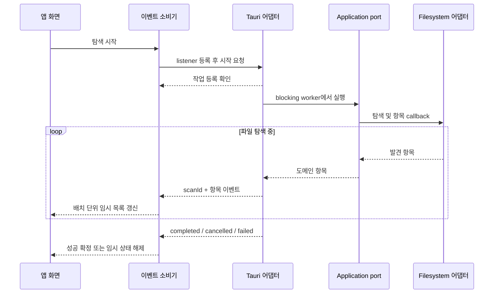

# 탐색 스트리밍 및 점진적 렌더링

2026-10-05 사용자 요청에 따라 다섯 앱의 디렉터리 탐색과 UI 반영 시점을 조사했습니다. 기존 완료 대기 대신 실제 탐색 중 항목을 전달할 수 있는 공통 API를 먼저 구현·검증하고 소비 앱을 연결합니다.

## 조사 결과

| 저장소 | 작업 전 구현 | 이번 적용 판단 |
| --- | --- | --- |
| movie-folder-explorer | `scan_directories_stream` → `folders-scanned` → `consumeFolderScan` → 80ms 목록 갱신 | 이미 적용. 도메인 폴더 분석·썸네일 정책 유지 |
| movie-explorer | `scan_movie_files`가 전체 재귀 검색·정렬 후 배열 반환, React Query 완료 후 표시 | 공통 재귀 stream으로 개선 |
| tauri-tree-file-explorer | `list_dir`가 한 디렉터리 전체 조회·정렬 후 반환 | 항목 수가 많은 디렉터리를 공통 listing stream으로 개선 |
| repo-explorer | progress 이벤트는 있으나 RepositoryRecord 배열은 terminal 성공 후 표시 | inspection 중 결과를 임시 표시하고 저장 성공 때 확정 |
| site-bookmark-browser | JSON 북마크 목록과 이미지 파일 접근. 이미지 그룹 정리를 위한 read_dir 사용 | 사용자용 파일 탐색 목록이 없어 적용 제외 |

근거 경로(각 앱 저장소 기준):

- Folder: `src-tauri/src/interface/commands.rs`, `src-tauri/src/infrastructure/filesystem_directory_scanner.rs`, `src/features/folder-browser/api/consume-folder-scan.ts`, `src/features/folder-browser/model/use-folder-explorer.ts`.
- Movie: `apps/desktop/src-tauri/src/application/mod.rs`, `apps/desktop/src-tauri/src/infrastructure/mod.rs`, `apps/desktop/src/entities/movie/api.ts`, `apps/desktop/src/pages/home/index.tsx`.
- Tree: `apps/desktop/src-tauri/src/application.rs`, `apps/desktop/src-tauri/src/outbound.rs`, `apps/desktop/src/entities/file-system/model/queries.ts`.
- Repo: `apps/desktop/src-tauri/src/application.rs`, `apps/desktop/src-tauri/src/infrastructure.rs`, `apps/desktop/src/entities/repository/scan-session.ts`, `apps/desktop/src/pages/repository/ui/RepositoryPage.tsx`.
- Bookmark: `src-tauri/src/infrastructure/library_images.rs`.

## 공통 구현

`explorer-fs-core`에 `scan_files_stream`과 `list_dir_stream`을 추가했습니다. `FnMut(Item) -> Result<(), String>` callback으로 탐색 도중 항목을 전달하고 `Fn() -> bool`로 취소를 확인합니다. 기존 `scan_files`·`list_dir`는 이를 수집한 뒤 기존 정렬을 적용합니다. 필터·symlink·개별 읽기 오류 처리는 기존 계약을 보존합니다.

Tauri-free 공통 모듈은 이벤트 이름·React Query·앱 저장 정책을 알지 못합니다. 기존 `scan-job` 등록·취소 관리와 `scan-client`의 listener 선등록·scanId 필터·종료 이벤트 수신 계약을 재사용합니다. Repo는 Git 탐색 및 catalog commit 경계가 있어 도메인 전용 inspector를 유지합니다.

## 검증 진행

공통 선행 검증: `pnpm check` 통과. Node29·Rust50(fs-core7 포함), 타입·소비 빌드·Storybook 빌드 통과. 새 fixture는 첫 항목 전달 후 취소, callback 실패, 배열 결과와 동등성, 숨김 필터, 잘못된 glob/경로를 확인합니다.

## 앱 적용

- Movie: application의 기본 영화 glob 정책을 유지하면서 `scan_files_stream`을 연결했습니다. `start_movie_scan`·`cancel_movie_scan`과 `movie-scan-event`로 항목 및 terminal 상태를 전달합니다. 공통 `scan-job`과 `scan-client`를 사용하고, 임시 결과는 40ms/64개 단위로 표시하며 완료 목록만 React Query에 반환합니다.
- Tree: `list_dir_stream`·`cancel_list_dir_stream`과 `directory-scan` 이벤트를 추가했습니다. 공통 `scan-job`과 `scan-client`를 사용하며 경로·숨김 설정별로 진행 상태를 공유합니다. QueryClient별 임시 store는 완료 캐시와 분리되어 같은 경로를 사용하는 패널들이 하나의 작업을 공유할 수 있습니다.
- Repo: `repository_scan_item`을 추가해 개별 저장소 inspection 완료 결과를 50ms 단위로 표시합니다. 성공 terminal에서만 최종 목록을 캐시에 반영합니다. 취소 요청 시 즉시 기존 저장 목록으로 복귀하고, 실패·시작 실패·새 작업·화면 종료에서 임시 목록을 제거합니다. 임시 목록의 메타데이터 편집·저장은 비활성화했습니다.
- Folder·Bookmark: 이번 작업에서 코드를 변경하지 않았습니다.

Repo는 Git 디렉터리 discovery가 끝난 뒤 inspection 단계부터 결과를 표시합니다. 이미 확인한 main의 관계는 worktree 첫 항목부터 포함하며, main이 나중에 확인되면 같은 항목 ID로 수정 이벤트를 보내 관계를 보완합니다. 전체 검사·catalog 저장 성공 후 최종 목록을 확정합니다. 기본 스키마·메타데이터 파일 위치·최종 정렬·취소 시 미저장 계약은 유지합니다.

## 검증 결과

| 대상 | 검증 |
| --- | --- |
| 공통 | Node29·Rust50, 타입·소비 빌드·Storybook 전체 check 통과 |
| Movie | Node14·Rust8, 타입·앱 빌드·Storybook·cargo check/fmt 통과 |
| Tree | Node14(설정5·스트리밍7·트리2)·Rust6, 타입·앱 빌드·cargo check/fmt 통과 |
| Repo | TS14·Rust18, 타입·앱 빌드·Storybook·cargo check/fmt 통과 |
| 경계 검사 | 다섯 앱 FSD/선별 Rust import 검사 통과 |

Tree의 `test.html`을 격리된 agent-browser 세션에서 실행했습니다. 메모리 filesystem의 항목 지연을 200ms로 늘려 `Scanning… 1` 상태에서 첫 행이 보이는 것을 확인했고, 최종 루트 폴더 전체 표시·숨김 토글·Documents 이동을 확인했습니다. 초기 Vite 의존성 최적화 중 dynamic import 오류가 있었으나 최적화 완료 후 새 세션의 재검증에서 페이지 오류0·정상 렌더링을 확인했습니다. 검증용 서버와 브라우저 세션은 종료했습니다.

## 리뷰 보완

- 조정 리뷰: Movie 로컬 작업 registry 대신 공통 scan-job 사용, Tree 완료 캐시/진행 상태 분리, 첫 항목 전 skeleton과 Scanning 상태, 완료 root 목록으로만 초기 트리 구성, 동일 directory 집합 재조회 시 트리 model 유지를 보완했습니다.
- Rust/JS 정렬 차이: Movie·Tree에서 대소문자 정규화 뒤 Unicode 코드포인트 순서를 적용해 보조 평면 문자와 BMP 문자 간 기존 Rust 정렬을 보존했습니다.
- 독립 backend 리뷰: Repo worktree 부모 누락 P2를 수정했습니다. main-first/worktree-first 실제 Git fixture와 Rust18을 재실행했고 재리뷰에서 추가 회귀가 발견되지 않았습니다.
- 독립 UI 리뷰: Movie의 부분 목록이 미도착 선택 폴더를 삭제로 간주하는 P2를 수정했습니다. Tree 테스트의 상위 FSD 참조도 widget 테스트로 분리했습니다. 최종 UI 재리뷰에서 Movie10·Tree9·Repo8의 관련 테스트를 직접 실행했고 아키텍처 검사와 함께 통과했습니다. 추가로 재현 가능한 회귀는 발견되지 않았습니다.

## 검증 범위와 제한

네이티브 Tauri 창·패키징·실제 사용자 대용량 디렉터리의 성능 측정은 실행하지 않았습니다. 브라우저 검증은 모의 IPC/filesystem이며 실제 OS 연동 검증과 구분합니다. 진행 중 OS I/O 자체는 중단하지 않고 항목 경계에서 취소를 확인합니다. IPC는 항목 단위이며 frontend 갱신을 배치하지만 전체 목록 보관과 최종 정렬 비용은 남습니다. 전달 순서는 최종 정렬 순서와 다를 수 있습니다.

Folder·Bookmark의 소스는 이번 작업에서 변경하지 않았습니다. 기존 미커밋 작업을 보존했으며 구현·리뷰 완료 당시에는 커밋·푸시하지 않았으며, 후속 계속 진행 요청으로 공통 저장소 변경을 `13c1eb5`에 커밋하여 origin/main에 푸시했습니다. 소비 앱의 변경은 아직 커밋·푸시하지 않았습니다. [작업 직전 snapshot 대비 변경 목록](streaming-exploration-changes.json)과 [작업 이력](../CONTEXT.md)을 함께 참고하세요.
